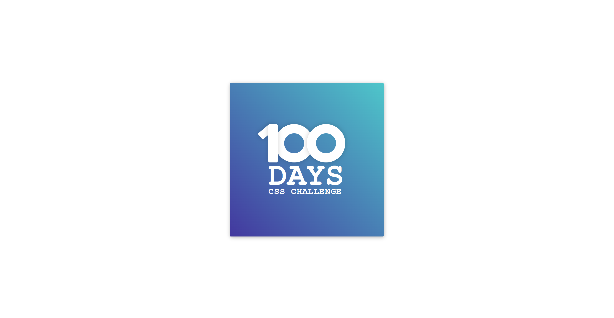

<h1>CSS Challenge - README</h1>

    <h2>Project Overview</h2>
    
This challenge involves creating a centered number display within a styled frame using only HTML and CSS. The goal is to create a visually appealing design featuring the number "100" with specific styles applied to the digits and surrounding elements.

    <h2>Table of Contents</h2>
    <ul>
        <li><a href="#preview">Preview</a></li>
        <li><a href="#installation">Installation</a></li>
        <li><a href="#usage">Usage</a></li>
        <li><a href="#structure">Structure</a></li>
        <li><a href="#styling">Styling</a></li>
        <li><a href="#challenges">Challenges</a></li>
        <li><a href="#contributing">Contributing</a></li>
        <li><a href="#credits">Credits</a></li>
        <li><a href="#license">License</a></li>
        <li><a href="#contact">Contact</a></li>
    </ul>

    <h2>Preview</h2>
    
Below is a preview of the final design for this challenge. You can also view it live on <a href="https://100dayscss.com/days/1/" target="_blank">100 Days CSS Challenge - Day 1</a>.

    

    <h2>Installation</h2>
    
To get started with this project, simply download the files and open them in your preferred web browser.

    
<strong>Files Included:</strong>

    <ul>
        <li><code>index.html</code> - The HTML file containing the structure of the project.</li>
        <li><code>style.css</code> - The CSS file containing the styling rules for the project.</li>
    </ul>

    <h2>Usage</h2>
    
Open the <code>index.html</code> file in your web browser to view the challenge. You can also view the styles in the <code>style.css</code> file to see how the design is implemented.

    <h2>Project Structure</h2>
    
The project is structured with the following files:

    <ul>
        <li><code>index.html</code> - Contains the HTML structure of the challenge.</li>
        <li><code>style.css</code> - Contains the CSS styles applied to the HTML elements.</li>
        <li><code>README.md</code> - Contains information about project.</li>
    </ul>
    
The HTML structure consists of a main <code>div</code> with the class "frame" that contains a centered number display and descriptive text.

    <h2>Styling</h2>
    
The CSS file <code>style.css</code> styles the layout and design of the number display. Key parts of the CSS include:

    <ul>
        <li>Frame styling to create a centered container with a gradient background.</li>
        <li>Centering the content within the frame using absolute positioning and transform properties.</li>
        <li>Creating the digits of the number "100" using <code>div</code> elements styled with specific dimensions, positions, and rotations.</li>
        <li>Styling the text elements to differentiate between the large "Days" and smaller "CSS Challenge" texts.</li>
    </ul>

    <h2>Challenges</h2>
    
Some challenges you might face while replicating this design include:

    <ul>
        <li>Ensuring the elements are perfectly centered within the frame.</li>
        <li>Creating the correct shape and position for each part of the digits.</li>
        <li>Applying the gradient background smoothly and ensuring browser compatibility.</li>
    </ul>

    <h2>Contributing</h2>
    
Contributions are welcome! If you have suggestions for improvements or new features, please follow these steps:

    <ul>
        <li>Fork the repository.</li>
        <li>Create a new branch (<code>git checkout -b feature/YourFeature</code>).</li>
        <li>Commit your changes (<code>git commit -m 'Add some feature'</code>).</li>
        <li>Push to the branch (<code>git push origin feature/YourFeature</code>).</li>
        <li>Open a Pull Request.</li>
    </ul>

    <h2>Credits</h2>
    
This project is part of the <a href="https://100dayscss.com/" target="_blank">100 Days CSS Challenge</a>. Special thanks to the creators of the challenge for their inspiration and resources.

    <h2>License</h2>
    
This project is licensed under the MIT License. See the <a href="https://github.com/Yashi-Singh-1/Day-1-CSS-Challenge?tab=MIT-1-ov-file">LICENSE</a> file for details.

    <h2>Contact</h2>
    
If you have any questions or suggestions, feel free to reach out:

    <ul>
        <li>Email: <a href="mailto:yashuchoudhary575@gmail.com">Yashi Singh</a></li>
        <li>GitHub: <a href="https://github.com/Yashi-Singh-1">github.com/Yashi-Singh-1</a></li>
        <li>LinkedIn: <a href="www.linkedin.com/in/yashi-singh-b4143a246">Yashi Singh (www.linkedin.com/in/yashi-singh-b4143a246)</a></li>
    </ul>

